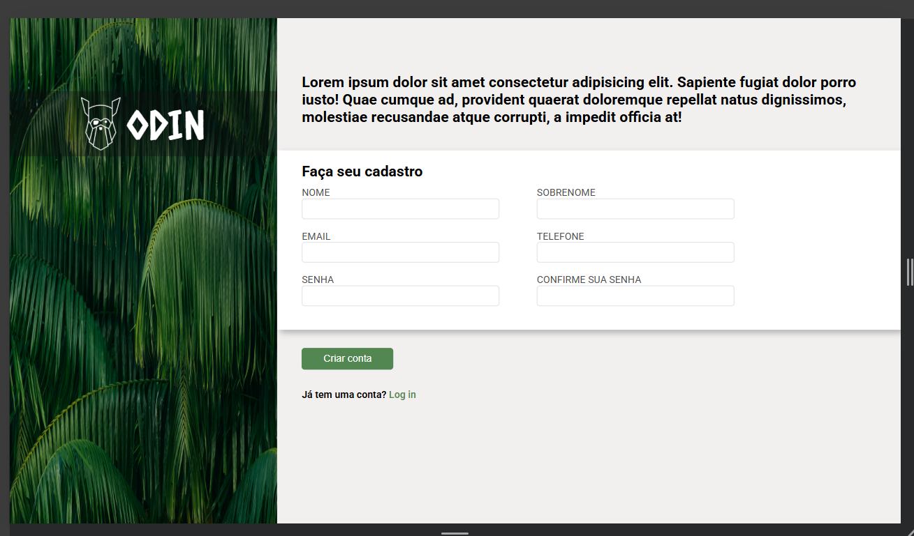

<h1>Formulário de Cadastro</h1>

<h2>Descrição</h2>

Projeto de estudo desenvolvido a partir de um <a href
="https://cdn.statically.io/gh/TheOdinProject/curriculum/afdbabfab03fbc34783c6b6f3920aba4a4d3b935/intermediate_html_css/forms/project_sign_up_form/imgs/sign-up-form.png">template base</a>.Nesse projeto pude aplicar conceitos como organizacação dos elementos,estilização e validações em formulários. 

<h2>Tecnologias</h2>

<a href="https://orlandoseven.github.io/formulario_cadastro/">
<h3>Demonstração do projeto</h3></a>
